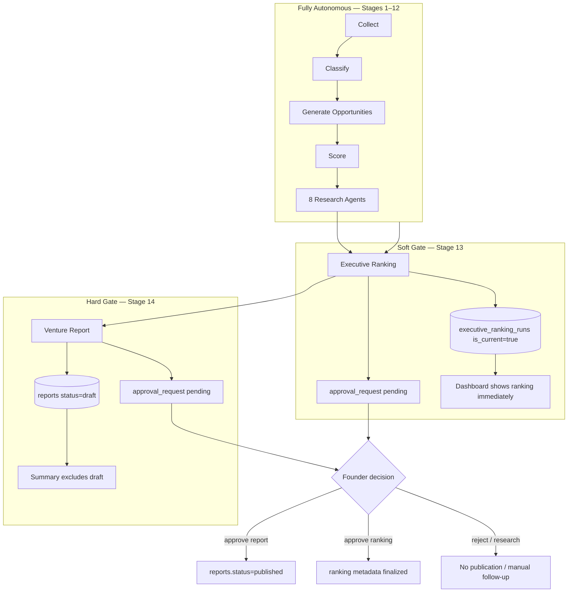

# Autonomy Policy Review — Production Readiness Remediation #9

**Date:** June 2026  
**Scope:** Formal review of founder approval gates and operating models for autonomous venture publication.  
**Constraint:** Analysis only — no behavior changes in this remediation.

**Formal recommendation (#13):** [autonomy-policy-recommendation.md](./autonomy-policy-recommendation.md) — decision record, migration plan, implementation estimates, and risk analysis (awaiting approval; no code until accepted).

**Primary blocker identified by audit:** `REQUIRE_FOUNDER_APPROVAL=true` (default) prevents venture reports from reaching `published` status without explicit founder action, which blocks fully autonomous venture publication even when the nightly pipeline completes successfully.

---

## Executive Summary

AI Venture Studio runs **stages 1–14 autonomously** via the pipeline orchestrator and nightly scheduler. Human intervention is concentrated at the **publication boundary** for executive rankings (soft gate) and venture recommendation reports (hard gate), controlled by a single boolean: `REQUIRE_FOUNDER_APPROVAL`.

The system is architecturally aligned with **Model A (Human-in-the-loop)** for venture publication, with an important nuance: executive rankings are generated and exposed to the dashboard **before** founder approval, while venture reports remain in `draft` until approved.

**Recommendation:** Retain **Model A** as the production default. Evolve toward **Model B (Human-on-the-loop)** only after adding post-publication monitoring, rollback, and alerting hooks — not by simply flipping `REQUIRE_FOUNDER_APPROVAL=false`.

---

## 1. Approval Checkpoint Map

### 1.1 Pipeline stages (14-stage orchestrator)

| Stage | Name | Autonomous? | Human checkpoint? | Notes |
|-------|------|-------------|-------------------|-------|
| 1 | COLLECT | Yes | No | Reddit, RSS, HN Algolia |
| 2 | CLASSIFY | Yes | No | LLM budget may block calls |
| 3 | GENERATE_OPPORTUNITIES | Yes | No | Pattern + LLM synthesis |
| 4 | SCORE | Yes | No | Deterministic engine |
| 5–12 | Research agents (8) | Yes | No | LLM budget may block calls |
| 13 | EXECUTIVE_RANKING | Yes | **Soft** | Ranking persisted and set `is_current`; approval request created if enabled |
| 14 | VENTURE_REPORT | Yes | **Hard** | Report saved as `draft` if approval enabled; `published` only after approve |

**Key finding:** The pipeline does **not** pause or fail waiting for founder approval. Nightly `run_pipeline` completes all stages; gates apply to **finalization and publication**, not execution.

### 1.2 Approval workflow (`ApprovalService`)

Controlled by `Settings.require_founder_approval` (`REQUIRE_FOUNDER_APPROVAL`, default `true`).

| Checkpoint | Trigger | Subject type | On create | On approve | On reject | On request_research |
|------------|---------|--------------|-----------|------------|-----------|---------------------|
| Executive ranking | `ExecutiveRankingService.generate_ranking()` | `executive_ranking` | `approval_requests` row `pending`; metadata on run | Metadata `approved` + `finalized_at` | Metadata `rejected` | Metadata `research_requested`; no auto re-run |
| Venture report | `VentureReportService.generate_venture_report()` | `venture_report` | Report `draft`; `approval_requests` row `pending` | `reports.publish()` → `published` | Metadata `rejected`; report stays draft | Metadata `research_requested`; manual follow-up |

Implementation references:

- `api/app/services/approval.py` — gate logic and finalization
- `api/app/ranking/service.py` — ranking + approval creation
- `api/app/reports/venture/service.py` — forces `publish=False` when approval enabled
- `api/app/pipeline/executor.py` — stages 13–14 invoke services without approval checks

### 1.3 Venture publication flow

```
Pipeline stage VENTURE_REPORT
  → VentureReportService.generate_venture_report(publish=True)
  → if approval.enabled: publish forced to False
  → INSERT reports (status=draft | published)
  → if approval.enabled: create_for_venture_report()
  → pipeline stage completes (success)

Founder action (dashboard /api/v1/approvals/{id}/approve)
  → ApprovalService._finalize_subject()
  → reports.publish() → status=published
  → dashboard summary "latest_venture" now includes report
```

When `REQUIRE_FOUNDER_APPROVAL=false`:

- No `approval_requests` created
- Venture reports created with `status=published` immediately
- CI uses `REQUIRE_FOUNDER_APPROVAL=false` for deterministic tests

### 1.4 Executive ranking flow

```
Pipeline stage EXECUTIVE_RANKING
  → ExecutiveRankingService.generate_ranking()
  → INSERT executive_ranking_runs (is_current=true)
  → if approval.enabled: create_for_executive_ranking()
  → pipeline stage completes

Dashboard immediately serves ranking via get_current_with_entries()
  (no filter on approval_status)

Founder approve
  → ranking_metadata.approval_status = approved, finalized_at set
  → does NOT unpublish or hide ranking if previously visible
```

**Asymmetry:** Ranking approval is **record-keeping and metadata finalization**, not access control. Venture report approval is **publication control**.

### 1.5 Report generation (non-venture)

| Report type | Approval gate? | Publication |
|-------------|----------------|-------------|
| `venture_recommendation` | Yes (when flag true) | Draft until approve |
| `top_opportunities` | No | Created by report services without approval |
| `pipeline_summary` | No | Created without approval |

Dashboard behavior:

- **Summary** (`get_summary`): latest venture report filtered to `status=published` only
- **Reports page** (`get_reports`): lists all venture reports regardless of status (includes drafts)

### 1.6 Opportunity review (separate from approval workflow)

| Mechanism | Field / API | Blocks pipeline? | Blocks publication? |
|-----------|-------------|------------------|---------------------|
| Opportunity triage | `opportunities.review_status` (`new`, `approved`, `rejected`, `deferred`) | **No** | **No** |
| API | `POST /api/v1/opportunities/{id}/review` | Manual founder workflow | Informational only |

Opportunity review is **not** wired into pipeline stages or venture publication. It is a parallel triage channel.

### 1.7 Other operational gates (not founder approval)

| Gate | Type | Effect |
|------|------|--------|
| LLM daily budget | Hard | `LLMBudgetService.try_prepare_call()` blocks agent LLM invocations |
| Pipeline lock | Concurrency | Prevents overlapping full pipeline runs |
| Dashboard BFF RBAC | Access control | Founder/Admin/Viewer roles (remediation #6); separate from autonomy policy |
| API key | Authentication | Direct API access; not per-user approval |

### 1.8 Checkpoint diagram



---

## 2. Where Autonomy Stops / Human Review Begins

| Boundary | Autonomy ends | Human review begins |
|----------|---------------|---------------------|
| Signal → opportunity | Never (within budget) | Optional triage via `review_status` |
| Research agents | Never (within budget) | Optional inspection in dashboard |
| Executive ranking | **Not for execution** — ranking runs and is visible | Approval request records founder sign-off; does not block data access |
| Venture report | **At publication** — content generated but not `published` | Founder must approve (or reject / request research) via `/approvals` |
| External action | N/A — system does not deploy products or post publicly | Founder acts outside the platform |

**Autonomous through:** data ingestion, classification, opportunity synthesis, scoring, all agent research, ranking computation, report **generation**.

**Human required for:** venture report **publication** (default); optional ranking sign-off; optional opportunity triage; approval decisions when research is requested.

---

## 3. Operating Models

### Model A — Human-in-the-loop (current default)

**Definition:** The system proposes rankings and venture reports; the founder explicitly approves before venture reports are published. Pipeline runs unattended; human action is required at the publication gate.

| Dimension | Assessment |
|-----------|------------|
| **Benefits** | Low risk of publishing unreviewed recommendations; aligns with product vision ("AI proposes; founder approves"); full audit trail (`approval_requests`, `approval_decisions`, metadata); supports reject and request-research flows |
| **Risks** | Nightly pipeline "succeeds" but produces no published venture report until founder acts; approval queue can grow; founder absence = stale `latest_venture` on dashboard summary; ranking visible before approval may confuse "approved" vs "draft" state |
| **Operational impact** | Founder must check `/approvals` daily (30–60 min workflow in runbook); alerts should notify on pending approvals (not fully automated today); CI disables gate for test speed |
| **Implementation complexity** | **Already implemented** — `REQUIRE_FOUNDER_APPROVAL=true`, dashboard approvals UI, REST API, metrics |

**Fit with architecture:** **Excellent.** Vision doc principle 3: "Human-in-the-loop by default." Single flag, clear service boundaries, tests in `api/tests/approval/`.

---

### Model B — Human-on-the-loop

**Definition:** The system auto-publishes venture reports and rankings; the founder monitors outputs and can reject, archive, or trigger follow-up research after publication.

| Dimension | Assessment |
|-----------|------------|
| **Benefits** | Fully unattended nightly cycle produces published artifacts; dashboard summary always current; reduces founder latency for time-sensitive signals |
| **Risks** | Published bad recommendations before human review; reputational/decision risk if founder trusts output blindly; reject-after-publish requires rollback semantics not fully built; `request_research` less meaningful post-publication |
| **Operational impact** | Founder shifts from gatekeeper to supervisor; requires strong alerting (Slack/webhook on new publications), diff/highlight of changes vs prior run, and clear rollback/archive procedures |
| **Implementation complexity** | **Medium** — set `REQUIRE_FOUNDER_APPROVAL=false` for immediate auto-publish, but production-grade Model B needs: post-publish notifications, optional cooling period, report versioning visibility, archive/retract API, dashboard "published by automation" labeling, audit log review workflow |

**Fit with architecture:** **Partial.** Auto-publish path exists (`require_founder_approval=false`), but observability and rollback tooling assume Model A. Alerting framework (#7) can notify on pipeline completion but not specifically on "new publication awaiting review."

---

### Model C — Fully autonomous

**Definition:** No founder approval gates; no expected human review in the operational loop. System runs and publishes on schedule with only budget/infra guardrails.

| Dimension | Assessment |
|-----------|------------|
| **Benefits** | Maximum automation; zero daily founder time; suitable for internal/experimental use or when outputs feed downstream systems automatically |
| **Risks** | Highest decision quality risk; LLM hallucinations and ranking errors propagate to published reports; no human proxy for founder fit beyond Human Proxy agent; legal/ethical exposure if reports treated as advice |
| **Operational impact** | Founder role becomes periodic calibration (sources, budget, agent config) not daily review; requires automated quality checks not present today (confidence thresholds, anomaly detection on rankings) |
| **Implementation complexity** | **Low for toggle** (`REQUIRE_FOUNDER_APPROVAL=false`) — **High for safe production** — needs automated quality gates, publication policies, and possibly confidence-based hold rules to replace human judgment |

**Fit with architecture:** **Poor for stated product vision.** Vision explicitly excludes "fully autonomous in production." Human Proxy agent scores founder fit but does not replace publication approval. Model C contradicts non-goals unless product scope changes.

---

## 4. Model Comparison Matrix

| Criterion | Model A (HITL) | Model B (HOTL) | Model C (Autonomous) |
|-----------|----------------|----------------|----------------------|
| Venture report publication | After approve | Auto + supervise | Auto |
| Ranking visibility | Immediate | Immediate | Immediate |
| Pipeline completion | Independent of approval | Independent | Independent |
| Audit trail | Strong | Needs post-publish audit | Minimal human trace |
| Founder daily time | Required (approvals) | Monitoring | None |
| Config change | Default | `REQUIRE_FOUNDER_APPROVAL=false` + additions | Same toggle |
| Vision alignment | High | Medium | Low |
| Current code readiness | **Production** | Partial | Toggle only |

---

## 5. Recommendation

**Adopt Model A (Human-in-the-loop) as the production default** — it matches the implemented architecture, vision document, approval service design, and dashboard workflows.

**Do not switch to Model C** without an explicit product decision to change the solo-founder, decision-support positioning.

**Path to Model B** (if autonomy is required later):

1. Keep approval records for audit but add `auto_publish_after_pipeline=true` as a separate, explicit flag (not conflated with disabling approval entirely).
2. Wire alerting to emit "venture report published" events with summary and diff link.
3. Add report `archived` / retract flow and dashboard indicator for founder review SLA.
4. Clarify executive ranking semantics: either hide unapproved rankings from dashboard or label them "pending sign-off."

**Minimal change for overnight publication today:** Setting `REQUIRE_FOUNDER_APPROVAL=false` achieves Model C-like behavior for reports only, but without the safety tooling — acceptable for private/dev environments, not recommended for production without additional guardrails.

---

## 6. Architecture Impact Analysis

### 6.1 Components affected by autonomy policy

| Component | Model A | Model B | Model C |
|-----------|---------|---------|---------|
| `ApprovalService` | Core path | Optional audit-only | Bypassed |
| `VentureReportService` | Draft + gate | Publish immediately | Publish immediately |
| `ExecutiveRankingService` | Creates approval record | Same | No approval record |
| `PipelineOrchestrator` | Unchanged | Unchanged | Unchanged |
| `DashboardService.get_summary` | Shows published venture only | Shows latest published | Shows latest published |
| `DashboardService.get_reports` | Shows drafts + published | All published | All published |
| Alerting | Pipeline failure alerts | Needs publication alerts | Needs quality alerts |
| BFF RBAC | Admin/founder for approvals | Same | Viewer may suffice |

### 6.2 Data model impact

- **No schema changes required** for Model A (current).
- Model B/C: consider `reports.published_by` (`automation` | `founder`), `reports.auto_published_at`, and indexing `approval_requests.status` for SLA queries.
- Executive ranking: today `is_current` is set at generation — Model B may need `approved_is_current` vs `latest_run` separation to avoid serving unapproved rankings as canonical.

### 6.3 Configuration surface

| Variable | Current default | Role |
|----------|-----------------|------|
| `REQUIRE_FOUNDER_APPROVAL` | `true` | Master gate for approval workflow |
| `REQUIRE_FOUNDER_APPROVAL` | `false` in CI | Test determinism |

Future (not implemented): `AUTO_PUBLISH_VENTURE_REPORTS`, `APPROVAL_SLA_HOURS`, `HIDE_UNAPPROVED_RANKINGS`.

### 6.4 Integration points

- **Scheduler → pipeline → stages 13–14:** Autonomy policy does not alter scheduling; only downstream publication state differs.
- **Dashboard BFF:** RBAC restricts who can call `POST /approvals/{id}/approve`; autonomy policy defines whether that step is required at all.
- **Observability:** `avs_approval_pending_total` metric exists; useful for Model A SLA monitoring.

---

## 7. Production Readiness Impact

### 7.1 Current audit score impact

| Area | With Model A (default) | If switched to B/C without additions |
|------|------------------------|--------------------------------------|
| Autonomous operation | **BLOCKED** — publication requires founder | **UNBLOCKED** — reports publish nightly |
| Decision quality | **HIGH** — human gate | **LOWER** — no gate |
| Operational burden | **MEDIUM** — daily approval | **LOW** — monitoring only |
| Production readiness (autonomy) | Partial — pipeline autonomous, publication not | Full automation, incomplete safety |

The audit blocker "cannot operate fully autonomously" is **by design** under Model A, not an implementation defect.

### 7.2 Production readiness checklist by model

| Requirement | Model A | Model B | Model C |
|-------------|---------|---------|---------|
| Nightly pipeline completes | Yes | Yes | Yes |
| Published venture report without human | No | Yes (with toggle) | Yes |
| Approval audit trail | Yes | Partial | No |
| Dashboard auth (BFF) | Yes (#6) | Yes | Yes |
| Alert on pending approval | Gap | N/A | N/A |
| Alert on auto-publication | N/A | Gap | Gap |
| E2E approval workflow | Partial (#8) | Needs update | Simpler path |
| Rollback published report | Manual/status only | Gap | Gap |

### 7.3 Recommended production posture (Model A)

1. **Keep** `REQUIRE_FOUNDER_APPROVAL=true` in production `.env`.
2. **Add operational SLA:** founder approves or rejects within 24h of nightly run (process, not code).
3. **Add alert rule:** pending venture report approval > N hours (future enhancement).
4. **Document asymmetry:** rankings are visible pre-approval; only venture report publication is gated.
5. **CI remains** `REQUIRE_FOUNDER_APPROVAL=false` — acceptable; document divergence from production.

### 7.4 Unblocking autonomous publication (if product requires it)

| Step | Effort | Risk |
|------|--------|------|
| Set `REQUIRE_FOUNDER_APPROVAL=false` | Trivial | High without monitoring |
| Implement Model B properly | Medium (1–2 sprints) | Medium |
| Implement quality auto-gates (confidence, coverage) | High | Lower long-term risk |

---

## 8. Decision Record

| Decision | Outcome |
|----------|---------|
| Default operating model | **Model A — Human-in-the-loop** |
| Change `REQUIRE_FOUNDER_APPROVAL` default? | **No** (this remediation) |
| Executive ranking pre-approval visibility | **Accepted known asymmetry** — document for founders |
| Opportunity `review_status` | **Out of scope** for publication gate — remains manual triage |
| Next implementation (if autonomy required) | Model B with auto-publish flag + publication alerts + rollback — separate remediation |

---

## 9. Related Documentation

- [vision.md](./vision.md) — human-in-the-loop principle
- [operations.md](./operations.md) — approval workflow runbook
- [pipeline.md](./pipeline.md) — stages 13–14
- [dashboard-auth.md](./dashboard-auth.md) — BFF RBAC (access control, not autonomy)
- [observability-alerting.md](./observability-alerting.md) — operational alerts

---

## 10. Verification References

Code paths reviewed (no modifications):

- `api/app/services/approval.py`
- `api/app/ranking/service.py`
- `api/app/reports/venture/service.py`
- `api/app/pipeline/executor.py`
- `api/app/services/dashboard.py`
- `api/app/config.py` (`require_founder_approval`)
- `api/tests/approval/test_approval_service.py`
- `web/src/components/approvals/approval-actions.tsx`
