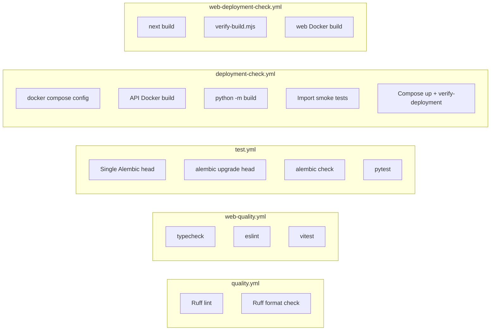

# CI/CD Workflows

GitHub Actions run on every push and pull request to `main`. Each workflow fails the build when its checks fail — there is no partial pass.

Workflow definitions live in [`.github/workflows/`](../.github/workflows/).

## Frontend CI

The `web/` dashboard is validated on every push and pull request to `main` by two workflows. Both must pass before merging.

| Workflow | File | Purpose |
|----------|------|---------|
| Web Quality | `web-quality.yml` | TypeScript, ESLint, Vitest unit tests |
| Web Deployment Check | `web-deployment-check.yml` | `next build`, route verification, Docker image |

See [web-deployment.md](./web-deployment.md) for deployment strategy (Vercel vs container).

## Pipeline overview



Backend and frontend workflows run **in parallel** on GitHub Actions. All required checks must pass before merging.

| Workflow | File | Purpose |
|----------|------|---------|
| Quality | `quality.yml` | Static analysis with Ruff |
| Test | `test.yml` | Database migrations and pytest |
| Deployment Check | `deployment-check.yml` | API Docker, packaging, import validation, Compose smoke |
| Web Quality | `web-quality.yml` | Frontend typecheck, lint, unit tests |
| Web Deployment Check | `web-deployment-check.yml` | Next.js production build and Docker validation |

## quality.yml

**Triggers:** `push` and `pull_request` to `main`

**Working directory:** `api/`

| Step | Command | Fails when |
|------|---------|------------|
| Lint | `ruff check app tests alembic` | Lint violations (E, F, I, UP) |
| Format | `ruff format --check app tests alembic` | Unformatted Python files |

Run locally:

```bash
cd api
ruff check app tests alembic
ruff format --check app tests alembic
```

Auto-fix formatting:

```bash
ruff format app tests alembic
ruff check --fix app tests alembic
```

## test.yml

**Triggers:** `push` and `pull_request` to `main`

**Services:** PostgreSQL 16 with pgvector, Redis 7

**Environment (CI):**

| Variable | Value |
|----------|-------|
| `API_KEY` | `ci-github-actions-api-key` |
| `POSTGRES_*` | `avs` / `ai_venture_studio` on port `5432` |
| `REDIS_HOST` | `localhost:6379` |
| `SCHEDULER_ENABLED` | `false` |
| `REQUIRE_FOUNDER_APPROVAL` | `false` |

### Job: Migration validation

Validates the Alembic revision chain and schema before tests run.

| Step | Command | Fails when |
|------|---------|------------|
| Single head | `alembic heads` | More than one migration head (branch conflict) |
| Apply | `alembic upgrade head` | Migration SQL errors or broken revision chain |
| Schema drift | `alembic check` | ORM models differ from applied database schema |

### Job: Pytest

Depends on the migration job completing successfully, then:

1. Starts fresh Postgres + Redis service containers
2. Runs `alembic upgrade head`
3. Runs `pytest tests/ -q`

Run locally (requires Docker Compose services):

```bash
docker compose up -d postgres redis
cd api
pip install -e ".[dev]"
alembic upgrade head
PYTHONPATH=. pytest tests/ -q
```

## deployment-check.yml

**Triggers:** `push` and `pull_request` to `main`

Validates that the API can be built and imported without a live database.

| Step | Command | Fails when |
|------|---------|------------|
| Compose config | `docker compose config --quiet` | Invalid `docker-compose.yml` |
| Docker build | `docker build ./api` | Dockerfile or dependency install failure |
| Editable install | `pip install -e ".[dev]"` | `pyproject.toml` / dependency resolution errors |
| Package build | `python -m build` | Hatchling wheel/sdist build failure |
| App import | `from app.main import app` | Application startup import errors |
| Worker import | `from app.workers.worker import WorkerSettings` | Worker module import errors |
| Compose smoke | `docker compose up` + `api/scripts/verify-deployment.sh` | Migration marker missing or `/health/ready` not HTTP 200 |

Run locally:

```bash
docker compose config --quiet
docker build -t ai-venture-studio-api:local ./api
cd api
pip install -e ".[dev]"
pip install build && python -m build
PYTHONPATH=. python -c "from app.main import app"
```

## Frontend CI

### web-quality.yml

**Triggers:** `push` and `pull_request` to `main`

**Working directory:** `web/`

| Step | Command | Fails when |
|------|---------|------------|
| Install | `npm ci` | Lockfile / dependency resolution errors |
| Typecheck | `npm run typecheck` | TypeScript errors |
| Lint | `npm run lint` | ESLint errors or warnings |
| Tests | `npm run test` | Vitest unit test failures |

Run locally:

```bash
cd web
npm ci
npm run typecheck
npm run lint
npm run test
```

### web-deployment-check.yml

**Triggers:** `push` and `pull_request` to `main`

| Job | Steps | Fails when |
|-----|-------|------------|
| Next.js build verification | `npm ci` → `npm run build` → `npm run verify-build` | Build errors, missing dashboard/API routes |
| Web Docker image | `docker build ./web` → container smoke test on `/` | Dockerfile or runtime startup failure |

Build verification ([`web/scripts/verify-build.mjs`](../web/scripts/verify-build.mjs)) asserts:

- All founder dashboard pages are in the route manifest
- BFF proxy route `/api/v1/[...path]` is present
- Server bundles exist for dashboard and API route handlers

Run locally:

```bash
cd web
npm ci
npm run build
npm run verify-build
docker build -t ai-venture-studio-web:local ./web
```

Full local gate (matches CI):

```bash
cd web
npm run validate
```

## Failure policy

| Failure type | Workflow | Result |
|--------------|----------|--------|
| Test failure | `test.yml` | Job failed; merge blocked |
| Migration issue | `test.yml` (`migrations` job) | Job failed; merge blocked |
| Lint / format issue | `quality.yml` | Job failed; merge blocked |
| Build / import issue | `deployment-check.yml` | Job failed; merge blocked |
| Frontend type/lint/test issue | `web-quality.yml` | Job failed; merge blocked |
| Frontend build / Docker issue | `web-deployment-check.yml` | Job failed; merge blocked |

## Branch protection (recommended)

On GitHub, enable branch protection for `main` and require status checks:

- **Quality / Ruff lint and format**
- **Test / Migration validation**
- **Test / Pytest**
- **Deployment Check / Build validation**
- **Web Quality / Typecheck, lint, and unit tests**
- **Web Deployment Check / Next.js build verification**
- **Web Deployment Check / Web Docker image**

## Adding migrations in CI

1. Create a revision under `api/alembic/versions/`
2. Ensure `down_revision` points to the current head (only one head)
3. Push — CI runs `upgrade head` and `alembic check`
4. If `alembic check` fails, update the migration or ORM models until schema and metadata match

## Related docs

- [architecture.md](./architecture.md) — system layout
- [database.md](./database.md) — schema and migration conventions
- [deployment.md](./deployment.md) — production deployment
- [web-deployment.md](./web-deployment.md) — frontend deployment strategy
- [api/README.md](../api/README.md) — local development and test commands
- [web/README.md](../web/README.md) — dashboard development and CI commands
