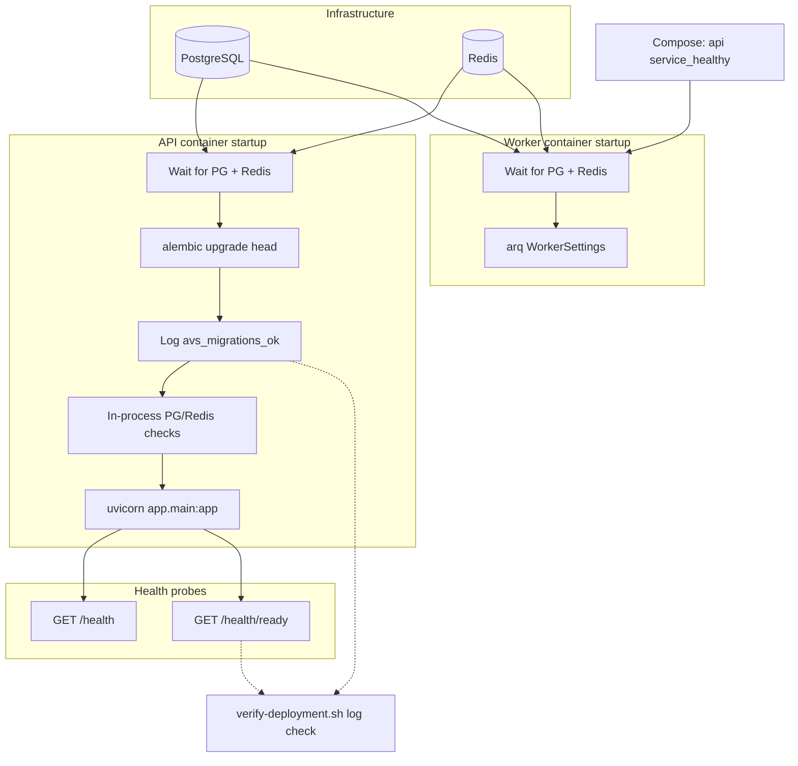

# Deployment

Production-ready deployment path for AI Venture Studio (AVS): automated migrations, dependency validation, Docker Compose orchestration, and CI verification.

---

## Architecture summary

AVS splits into four runtime roles:

| Role | Image / process | Responsibility |
|------|-----------------|----------------|
| PostgreSQL (pgvector) | `pgvector/pgvector:pg16` | Primary data store |
| Redis | `redis:7-alpine` | Queue, locks, observability keys |
| API | `api/Dockerfile` | FastAPI, APScheduler, Alembic migrations on start |
| Worker | Same API image, `arq` command | Background jobs (no migrations) |
| Web (optional) | `web/Dockerfile` | Next.js BFF dashboard — **not** in Compose by default |

The API container entrypoint waits for PostgreSQL and Redis, runs `alembic upgrade head`, runs in-process PostgreSQL/Redis readiness checks (same helpers as `GET /health/ready`), then starts Uvicorn. The worker entrypoint waits for dependencies only and starts after the API healthcheck passes (migrations already applied).

The web dashboard is intentionally deployed separately (Vercel or a dedicated web container) so frontend and backend release cycles stay independent. See [Why web is not in Compose](#why-web-is-not-in-docker-compose).

---

## Deployment flow



---

## Operational risk reduction

| Previous gap | Remediation |
|--------------|-------------|
| Manual `alembic upgrade head` before deploy | API entrypoint runs migrations automatically; failure exits with code 10 |
| API started before DB/Redis ready | Bootstrap blocks on sync PG/Redis checks (timeout → exit 11) |
| Liveness-only Docker healthcheck | Compose uses `GET /health/ready` (PostgreSQL, Redis, optional worker/scheduler/alerting) |
| Worker could start before schema migrated | Worker `depends_on: api: service_healthy` |
| No automated deploy verification | `api/scripts/verify-deployment.sh` + `compose-smoke` CI job |
| Undocumented web Compose choice | Documented below; aligns with [web-deployment.md](./web-deployment.md) |

Residual risks (unchanged by design):

- **Multi-replica API**: APScheduler runs in-process; run one scheduler-enabled replica or use external cron. See [Scheduler considerations](#scheduler-considerations).
- **Worker readiness**: `WORKER_READINESS_REQUIRED` defaults to `false`; enable in production if you require worker heartbeats in `/health/ready`.

---

## Prerequisites

| Requirement | Version |
|-------------|---------|
| Python | 3.12+ |
| Node.js | 20+ (for dashboard) |
| Docker & Docker Compose | Latest stable |
| PostgreSQL | 16 with pgvector |
| Redis | 7 |

---

## Local development

### 1. Environment

```bash
cp .env.example .env
# Edit .env — set API_KEY (min 16 chars) and OPENAI_API_KEY
```

### 2. Infrastructure only

```bash
docker compose up -d postgres redis
```

### 3. Backend (host)

Migrations run automatically via bootstrap before Uvicorn:

```bash
cd api
python3.12 -m venv .venv && source .venv/bin/activate
pip install -e ".[dev]"
python -m app.deployment.bootstrap --mode api --alembic-cwd .
uvicorn app.main:app --reload --host 0.0.0.0 --port 8000
```

Or run migrations explicitly (same as Docker):

```bash
alembic upgrade head
```

### 4. Worker (separate terminal)

```bash
cd api
python -m app.deployment.bootstrap --mode worker
arq app.workers.worker.WorkerSettings
```

### 5. Dashboard (separate terminal)

```bash
cd web
npm install
# web/.env.local: API_URL=http://localhost:8000, API_KEY=<root .env>
npm run dev
```

---

## Docker Compose (API + worker)

```bash
cp .env.example .env
docker compose up --build
```

| Service | Port | Notes |
|---------|------|-------|
| postgres | 5432 | Health: `pg_isready` |
| redis | 6379 | Health: `redis-cli ping` |
| api | 8000 | Entrypoint: deps → migrate → readiness → uvicorn |
| worker | — | Starts after API healthy; no migrations |

**Migrations:** Applied automatically on API container start. Success is logged as `avs_migrations_ok`.

**Verify a running stack:**

```bash
cd api && pip install -e .
./api/scripts/verify-deployment.sh
```

---

## Why web is not in Docker Compose

The `web` service is **not** included in root `docker-compose.yml` because:

1. **Release independence** — Next.js and Python scale and deploy on different cadences ([web-deployment.md](./web-deployment.md)).
2. **Recommended production path** — Vercel (or similar) for the BFF dashboard; API on containers/VPS.
3. **Image boundary** — `api/Dockerfile` stays Python-only; `web/Dockerfile` is a multi-stage Node build.
4. **Local dev ergonomics** — `npm run dev` hot-reload is faster than rebuilding the web image on every change.

For a full local Docker stack including web, add an optional service (see [web-deployment.md](./web-deployment.md#optional-add-web-to-compose-local-full-stack)). Production should still prefer split deployment.

---

## Production architecture

```
┌─────────────┐     ┌──────────────────────────────┐
│  Vercel /   │     │  VPS or container platform   │
│  Next.js    │────►│  FastAPI + ARQ worker        │
│  (web/)     │ BFF │  (api/ Docker image)         │
└─────────────┘     └──────────┬───────────────────┘
                               │
              ┌────────────────┼────────────────┐
              ▼                ▼                ▼
        Managed PG       Managed Redis      OpenAI API
```

### API / worker containers

```bash
docker build -t ai-venture-studio-api ./api
docker run -d --env-file .env -p 8000:8000 ai-venture-studio-api
docker run -d --env-file .env ai-venture-studio-api \
  arq app.workers.worker.WorkerSettings
```

Entrypoint behavior matches Compose: API runs migrations; worker waits for dependencies only.

### Environment variables (production)

| Variable | Required | Notes |
|----------|----------|-------|
| `ENVIRONMENT` | Yes | `production` disables `/docs` |
| `API_KEY` | Yes | Min 16 characters |
| `OPENAI_API_KEY` | Yes | LLM agents |
| `POSTGRES_*` | Yes | Managed PostgreSQL with pgvector |
| `REDIS_*` | Yes | Managed Redis |
| `WORKER_READINESS_REQUIRED` | Optional | `true` to require worker in `/health/ready` |
| `LOG_JSON` | Recommended | Structured logs |

---

## Health checks

| Endpoint | Purpose | Checks |
|----------|---------|--------|
| `GET /health` | Liveness | Process up |
| `GET /health/ready` | Readiness | PostgreSQL, Redis, worker (optional), scheduler (if enabled), alerting |

Docker Compose API healthcheck: `GET /health/ready`.

Implementation: [`api/app/observability/readiness.py`](../api/app/observability/readiness.py), bootstrap: [`api/app/deployment/bootstrap.py`](../api/app/deployment/bootstrap.py).

---

## Migrations

- **Docker / production API start:** `alembic upgrade head` in entrypoint (fail fast, exit code 10).
- **CI:** `test.yml` validates heads, upgrade, `alembic check`.
- **Web container:** Never runs migrations.

---

## CI/CD

| Workflow | Purpose |
|----------|---------|
| `quality.yml` | Ruff lint + format |
| `test.yml` | Migrations + pytest |
| `deployment-check.yml` | Docker build, packaging, **Compose smoke + verify-deployment** |
| `web-quality.yml` | Frontend checks |
| `web-deployment-check.yml` | Next.js build + web Docker |

See [ci.md](./ci.md).

---

## Security checklist

- [ ] `API_KEY` is cryptographically random
- [ ] `OPENAI_API_KEY` only in server/worker env
- [ ] `ENVIRONMENT=production`
- [ ] HTTPS at reverse proxy
- [ ] Database and Redis not publicly exposed

---

## Scheduler considerations

APScheduler runs inside the API process. For multiple API replicas, disable scheduler on all but one instance or use external cron → `POST /api/v1/jobs/{name}`.

---

## Related documentation

- [web-deployment.md](./web-deployment.md) — frontend deployment
- [operations.md](./operations.md) — runbook
- [ci.md](./ci.md) — GitHub Actions
- [architecture.md](./architecture.md) — system design
