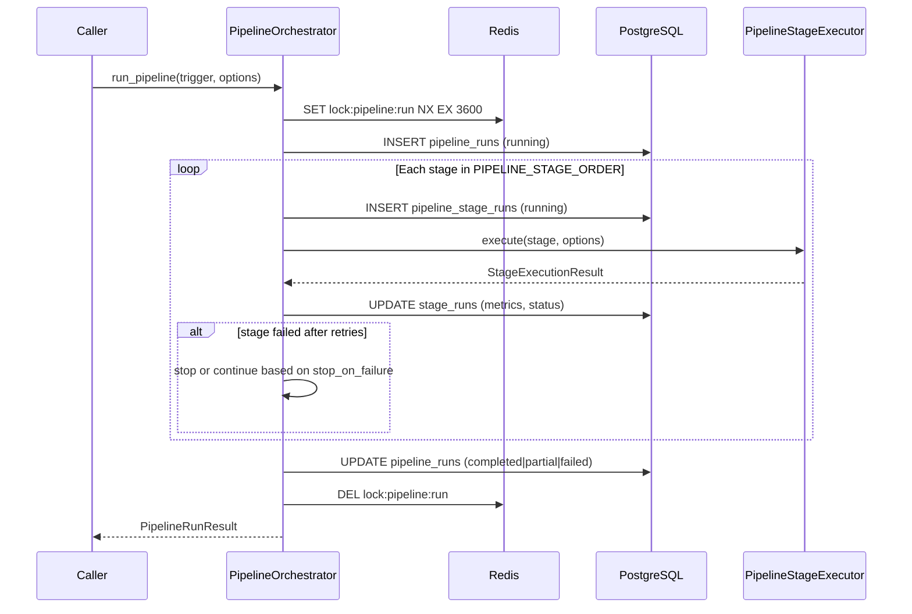
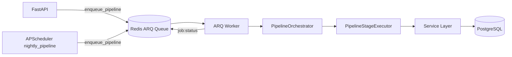

# Pipeline Orchestration

How the Venture Studio coordinates 14 pipeline stages across the orchestrator, ARQ workers, and APScheduler.

---

## Components

| Component | Module | Role |
|-----------|--------|------|
| Orchestrator | `app/pipeline/orchestrator.py` | Runs all stages sequentially with retries, locking, audit |
| Executor | `app/pipeline/executor.py` | Shared stage logic for orchestrator and workers |
| Constants | `app/pipeline/constants.py` | `PIPELINE_STAGE_ORDER`, lock key |
| Enqueue | `app/workers/enqueue.py` | API-side ARQ job publishing |
| Jobs | `app/workers/jobs.py` | ARQ job function definitions |
| Scheduler | `app/scheduler/` | Nightly cron → enqueue `run_pipeline` |

---

## Execution Modes

### 1. Synchronous full pipeline

```
POST /api/v1/pipeline/run
→ PipelineOrchestrator.run_pipeline() in API/worker process
→ 201 PipelineRunResult
```

Blocks until all 14 stages complete or fail. Suitable for manual runs and integration tests.

### 2. Background full pipeline

```
POST /api/v1/pipeline/run?background=true
→ enqueue_pipeline() → ARQ run_pipeline job
→ 202 JobEnqueueResult { job_id }

POST /api/v1/jobs/run-pipeline
→ Same as above
```

Poll status: `GET /api/v1/jobs/{job_id}`

### 3. Single stage (manual only)

```
POST /api/v1/jobs/{job_name}
→ ARQ stage job → PipelineStageExecutor.execute(stage)
→ 202 JobEnqueueResult
```

Valid job names: `collect`, `classify`, `generate_opportunities`, `score`, `market_research`, `competitor_analysis`, `customer_research`, `revenue_validation`, `product_strategy`, `go_to_market`, `growth_strategy`, `human_proxy`, `executive_ranking`, `venture_report`

**Not used by the scheduler.** Cron enqueues mode 2 via `nightly_pipeline` only.

### 4. Scheduled nightly automation

```
APScheduler 02:00 UTC → nightly_pipeline
→ enqueue_pipeline(trigger=SCHEDULED)
→ ARQ run_pipeline → PipelineOrchestrator.run_pipeline()
→ One pipeline_runs record, 14 stages in canonical order (including score)
```

See [scheduler.md](./scheduler.md).

---

## Orchestrator Flow



### Retry policy

- Per-stage retries: `PIPELINE_MAX_RETRIES` (default 3)
- Backoff: `PIPELINE_RETRY_BACKOFF_SEC` (default 0.5s)
- Failed stage recorded in `pipeline_stage_runs.error_detail`
- Pipeline failure alerts via `app/observability/alerting/`

### Locking

- Redis key: `lock:pipeline:run` (configurable via `PIPELINE_LOCK_KEY`)
- TTL: `PIPELINE_LOCK_TTL_SEC` (default 3600)
- Prevents concurrent full pipeline runs
- Stage-only jobs use separate idempotency locks: `lock:job:{name}:{key}`

---

## Worker Integration



Worker entrypoint: `arq app.workers.worker.WorkerSettings`

Worker startup (`app/workers/context.py`):

- Registers Reddit, RSS, and HN Algolia collectors
- Initializes observability and alerting
- Refreshes worker heartbeats

15 registered functions in `WorkerSettings.functions` (14 stage jobs + `run_pipeline`).

---

## Scheduler Integration

The scheduler **calls** the orchestrator indirectly by enqueuing `run_pipeline`:

| UTC | Scheduler job | ARQ job | Result |
|-----|---------------|---------|--------|
| 02:00 | `nightly_pipeline` | `run_pipeline` | Full 14-stage `pipeline_runs` record |

Manual trigger: `POST /api/v1/scheduler/run/nightly_pipeline`

---

## Stage Executor Mapping

`PipelineStageExecutor.execute()` dispatches to service methods:

| Stage | Service call |
|-------|-------------|
| COLLECT | `services.collection.collect_enabled_sources()` |
| CLASSIFY | `services.classification.classify_pending()` (loop) |
| GENERATE_OPPORTUNITIES | `services.generation.generate()` |
| SCORE_OPPORTUNITIES | `services.scoring.score_all()` |
| MARKET_RESEARCH | `services.market_research.generate_batch()` |
| COMPETITOR_ANALYSIS | `services.competitor_intelligence.generate_batch()` |
| CUSTOMER_RESEARCH | `services.customer_research.generate_batch()` |
| REVENUE_VALIDATION | `services.revenue_validation.generate_batch()` |
| PRODUCT_STRATEGY | `services.product_strategy.generate_batch()` |
| GO_TO_MARKET | `services.go_to_market.generate_batch()` |
| GROWTH_STRATEGY | `services.growth_strategy.generate_batch()` |
| HUMAN_PROXY | `services.human_proxy.generate_batch()` |
| EXECUTIVE_RANKING | `services.executive_ranking.generate_ranking()` |
| VENTURE_REPORT | `services.venture_reports.generate_report()` |

---

## Pipeline Run Options

Passed via `PipelineRunRequest.options` or job `options` JSON:

| Option | Description |
|--------|-------------|
| `force` | Re-run stages even if recently completed |
| `classify_batch_size` | Override classify batch size |
| `classify_max_batches` | Max classify loops |
| `score_limit` | Max opportunities to score |
| `top_n` | Top N for ranking/report stages |
| `founder_profile_id` | Human proxy / ranking context |
| `stop_on_failure` | Abort remaining stages after first failure |

---

## Monitoring

| Endpoint | Data |
|----------|------|
| `GET /api/v1/pipeline/runs` | Paginated pipeline run list |
| `GET /api/v1/pipeline/runs/{id}` | Run detail + stage runs |
| `GET /api/v1/dashboard/pipeline` | Dashboard-optimized view |
| `GET /api/v1/jobs/{job_id}` | ARQ job status from Redis |
| `GET /api/v1/scheduler/jobs` | Cron config + last run |
| `GET /metrics` | Prometheus metrics |
| `GET /api/v1/dashboard/metrics` | JSON observability snapshot |

---

## Failure Recovery

| Scenario | Recovery |
|----------|----------|
| Worker crash mid-pipeline | Lock TTL expires; inspect `pipeline_runs`; re-trigger |
| Stage partial failure | Run status `partial`; re-run single stage via `/jobs/{name}` |
| Budget exceeded | Agent stage fails; check `GET /budget`; increase cap or wait for UTC reset |
| Scheduler enqueue failure | Check `scheduler_runs.error`; manual `POST /scheduler/run/nightly_pipeline` |
| All collectors failed | COLLECT stage fails; check `sources.last_error` and alerting |

---

## Related Documentation

- [pipeline.md](./pipeline.md) — per-stage behavior
- [workers.md](./workers.md) — ARQ configuration
- [scheduler.md](./scheduler.md) — cron schedule
- [operations.md](./operations.md) — day-to-day runbook
