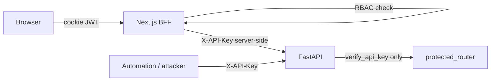

# V2 RC4 — Production security report (API authorization)

**Sprint:** Release Candidate #4 — authorization review (analysis only)  
**Date:** 2026-06-04  
**Scope:** API authentication, `protected_router`, API key validation, dashboard BFF, role handling  
**Constraint:** No authentication redesign; no code changes in this sprint.

## Audit verdict (aligned with prior scoring)

| Control | Status | Summary |
|---------|--------|---------|
| **API authentication** | **PASS** | Valid `X-API-Key` required for all `/api/v1/*` except health under v1; constant-time compare |
| **API authorization** | **FAIL** | Single shared secret; no per-route, per-role, or per-user enforcement on FastAPI |
| **Dashboard BFF authorization** | **PASS** (partial) | Session JWT + RBAC before proxy; does not extend to direct API clients |

**Primary finding:** Authorization is enforced at the **BFF boundary only**. Anyone with the shared `API_KEY` has **founder-equivalent** access to the entire protected surface.

---

## 1. Architecture summary

| Layer | File(s) | Mechanism |
|-------|---------|-----------|
| API auth | `api/app/api/deps.py` | `verify_api_key` — `secrets.compare_digest` vs `settings.api_key` |
| Route gating | `api/app/api/v1/router.py` | `protected_router = APIRouter(dependencies=[Depends(verify_api_key)])` |
| Public | `health.py`, `app/main.py` | `/health`, `/health/ready`, `/metrics` — no API key |
| Production key rules | `deployment/production_validation.py` | Length ≥32, block example/CI values when `ENVIRONMENT=production` |
| BFF auth | `web/src/app/api/v1/[...path]/route.ts` | Session + RBAC, then inject `API_KEY` |
| BFF RBAC | `web/src/lib/auth/rbac.ts`, `bff-guard.ts` | Role: `founder` \| `admin` \| `viewer` |

---

## 2. Privileged operations map

All routes below require only a valid `X-API-Key` at the API layer. BFF may further restrict by role (see §3).

### Tier P0 — Highest impact (automation abuse, cost, publication)

| Operation | Method | Path prefix | Impact |
|-----------|--------|-------------|--------|
| Run full pipeline (sync) | POST | `/pipeline/run` | Full 14-stage run, LLM spend, data mutation |
| Enqueue pipeline | POST | `/jobs/run-pipeline`, `/pipeline/run?background=true` | Background pipeline |
| Enqueue stage job | POST | `/jobs/{job_name}` | Partial pipeline / agent work |
| Trigger scheduler job | POST | `/scheduler/run/{job_name}` | Collection, nightly pipeline, etc. |
| Disable scheduler job | PATCH | `/scheduler/jobs/{job_name}` | Stop automated collection/runs |
| Approve venture / ranking | POST | `/approvals/{id}/approve` | Publishes or advances approval workflow |
| Reject / request research | POST | `/approvals/{id}/reject`, `.../research` | Workflow control |
| Report publish / mutate | POST/PATCH/DELETE | `/reports/*` | Publication state, content |
| Executive ranking generate | POST | `/executive-ranking/*` | Ranking + downstream approvals |
| Executive / venture report generate | POST | `/executive-reports/*`, `/reports/*` | LLM + storage |
| Send test alert | POST | `/observability/alerts/test` | External webhook/Slack spam |

### Tier P1 — Agent & research execution (LLM cost, data writes)

| Domain | Typical mutations |
|--------|-------------------|
| Opportunities | POST create, PATCH, POST generate/score/review |
| Complaints | POST classify (batch), PATCH, DELETE |
| Market / competitor / customer / revenue / product / GTM / growth | POST `.../run`, `.../validate`, research triggers |
| Human proxy | POST evaluate / batch operations |
| Revenue validation | POST validate pending / per opportunity |

### Tier P2 — Platform configuration (data integrity)

| Resource | Methods |
|----------|---------|
| Sources | POST, PATCH, DELETE `/sources/*` |
| RSS feeds | POST, DELETE `/rss-feeds/*` |
| Categories | POST, PATCH `/categories/*` |
| Complaints | DELETE `/complaints/*` |

### Tier P3 — Read-sensitive (no mutation, still confidential)

| Area | Examples |
|------|----------|
| Dashboard aggregates | GET `/dashboard/*` |
| Budget | GET `/budget/*` |
| Pipeline history | GET `/pipeline/runs/*` |
| Jobs | GET `/jobs/*` |
| Approvals queue | GET `/approvals` |
| All list/detail GETs | Opportunities, reports, agent outputs |

### Unauthenticated (attack surface)

| Endpoint | Risk |
|----------|------|
| `GET /health`, `GET /health/ready` | Low — liveness/readiness |
| `GET /metrics` | **Medium** — Prometheus metrics (operational fingerprinting) |

---

## 3. BFF role handling (authorization at edge)

Documented in [dashboard-auth.md](./dashboard-auth.md). Code: `web/src/lib/auth/rbac.ts`.

| Role | API via BFF | Gaps vs API |
|------|-------------|-------------|
| **founder** | All paths, all methods | Matches full API key power when proxied |
| **admin** | GET: viewer + admin read prefixes; POST/PATCH/DELETE: `approvals/`, `pipeline/`, `scheduler/`, `jobs/`, `executive-ranking/` only | Cannot mutate `sources`, `rss-feeds`, `categories`, `complaints` at BFF; **can still do so with raw API key** |
| **viewer** | GET/HEAD on `dashboard`, `budget`, `reports`, `opportunities`, `executive-reports` only | No mutations at BFF; **read bypass via API key** includes approvals, pipeline, agents |

**Approval mutations:** Enforced for `admin`+ at BFF; **not** attributed to individual users on FastAPI (no `X-User-Id` header).

---

## 4. Model evaluation

### Model A — Trusted internal API (recommended for V2)

**Profile:** Private network or VPC; small trusted team; dashboard via BFF; automation uses one rotatable service key.

| Criterion | Fit |
|-----------|-----|
| Single `API_KEY` | Acceptable if API is **not** internet-facing |
| BFF RBAC | Sufficient for **human** operators |
| Founder approval (Model A autonomy) | Complements security; publication gate is business policy |
| Audit expectation | **PASS** auth + **conditional PASS** authz with Tier 1 constraints |

**Minimum acceptable:** Tier 1 deployment constraints (see [rc4-authorization-recommendations.md](./rc4-authorization-recommendations.md)).

### Model B — Multi-user internal platform

**Profile:** Several staff roles; shared automation; possible direct API use by internal tools.

| Criterion | Fit |
|-----------|-----|
| BFF RBAC | Good for browser users |
| Flat API key | **Insufficient** — admin and viewer distinction lost for API clients |
| Escalation | Leaked key > any BFF role |
| Required delta | Scoped API keys or service identities (Tier 2); API-layer role checks on P0/P1 |

**Verdict:** Current V2 is **partially ready** — BFF only. Needs Tier 2 before credentialed non-founders use scripts against `/api/v1`.

### Model C — Public SaaS

**Profile:** Internet-exposed API; customers bring API keys; multi-tenant.

| Criterion | Fit |
|-----------|-----|
| Shared secret | **Unacceptable** |
| BFF-only RBAC | **Irrelevant** to direct API consumers |
| Missing controls | Per-tenant isolation, OAuth2/OIDC, per-key scopes, rate limits, abuse detection, audit per principal |

**Verdict:** **Not supported.** Would require V3+ identity platform; out of scope for “no redesign” but documented as future roadmap.

---

## 5. Authorization gaps (root causes)

1. **No secondary authorization** after `verify_api_key` — `Authenticated` type is unused for differentiation; all protected routers share one dependency.
2. **BFF RBAC is not authoritative** — FastAPI does not receive role or user identity.
3. **No mutation audit trail** tied to dashboard users on API logs (only generic observability middleware).
4. **No application rate limiting** — brute force on API key or login is an edge/WAF concern.
5. **`/metrics` unauthenticated** — acceptable on private scrape networks only.
6. **Admin role at BFF** can approve and run pipelines — intentional, but equivalent to high trust; API key grants strictly more (platform delete, all agents).

---

## 6. Production deployment constraints (minimum acceptable)

Without changing authentication mechanism:

1. **Network:** Do not expose port 8000 to the public internet; API reachable only from BFF host, worker, and break-glass admin networks.
2. **Secrets:** `API_KEY` ≥32 chars, secret manager, rotation procedure; never in browser or client bundles.
3. **Web:** `API_KEY` only in server env; `AUTH_SECRET` ≥32 chars; `passwordHash` in `DASHBOARD_USERS` (no plaintext passwords in prod).
4. **TLS:** Terminate HTTPS at load balancer; HSTS for dashboard origin.
5. **CORS:** Production uses empty allowlist (`main.py`) — direct browser → API calls blocked cross-origin.
6. **OpenAPI UI:** Disabled when `ENVIRONMENT=production`.
7. **Autonomy:** Keep `REQUIRE_FOUNDER_APPROVAL=true` (Model A) unless explicit product sign-off for auto-publish.
8. **Metrics:** Bind `/metrics` to internal scrape network or protect with network policy / mTLS.

These constraints make **Model A** authorization **acceptable** for private founder production; they do **not** satisfy Model B/C alone.

---

## 7. Related documents

| Deliverable | File |
|-------------|------|
| Threat assessment | [rc4-threat-assessment.md](./rc4-threat-assessment.md) |
| Implementation recommendations & RBAC roadmap | [rc4-authorization-recommendations.md](./rc4-authorization-recommendations.md) |
| Prior short guide | [api-authorization-production.md](./api-authorization-production.md) |
| BFF threat notes | [security-impact-auth.md](./security-impact-auth.md) |

## 8. Conclusion

**Authentication is production-grade for a shared-secret model** (constant-time validation, production key enforcement). **Authorization fails the audit** because confidentiality and integrity of all protected resources hinge on one secret. For V2 RC **private deploy under Model A**, that failure is **mitigated by deployment posture**, not by API-layer RBAC. Expanding to Model B or C requires the phased roadmap in the recommendations document — without redesigning the current `verify_api_key` pattern in Sprint 4.
