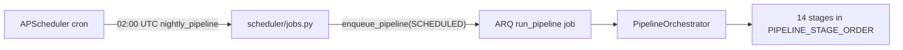

# Scheduler → Pipeline Orchestrator

Production remediation #1: scheduled runs now enqueue a **single orchestrated pipeline** instead of fragmented stage jobs.

## Architecture



### Before (fragmented)

```
02:00 collect → 03:00 classify → … → 08:00 venture_report
(each cron enqueues independent ARQ stage jobs)
```

Problems: no unified `PipelineRun`, parallel research agents, partial completion, weaker tracing/metrics.

### After (orchestrated)

```
02:00 nightly_pipeline → run_pipeline → PipelineOrchestrator → full lifecycle
```

Benefits:

- One `PipelineRun` record with stage rows
- One `pipeline.run` trace span hierarchy (plus per-stage spans)
- Unified Prometheus metrics (`avs_pipeline_*`)
- Orchestrator lock prevents concurrent pipeline runs
- Stage retry/backoff preserved inside orchestrator

## Scheduler job

| Job | Cron (UTC) | ARQ enqueue | Trigger |
|-----|------------|-------------|---------|
| `nightly_pipeline` | `0 2 * * *` | `run_pipeline` | `PipelineTrigger.SCHEDULED` |

Legacy per-stage scheduler jobs (`collect`, `classify`, …) are **disabled** on `ensure_defaults()` but remain in the database for history. They are no longer registered with APScheduler.

## Manual execution (unchanged)

| Use case | Endpoint |
|----------|----------|
| Full pipeline (sync) | `POST /api/v1/pipeline/run` |
| Full pipeline (background) | `POST /api/v1/pipeline/run?background=true` |
| Single stage | `POST /api/v1/jobs/{stage_name}` |
| Manual nightly trigger | `POST /api/v1/scheduler/run/nightly_pipeline` |

## Idempotency

Scheduled runs set `idempotency_key=scheduler:nightly_pipeline:{YYYY-MM-DD}` on the `run_pipeline` ARQ job to skip duplicate enqueues the same day.

## Production impact

| Area | Impact |
|------|--------|
| **Observability** | Single pipeline run ID, metrics, and trace tree per nightly execution |
| **Operations** | Failures surface in `pipeline_runs` / dashboard pipeline view instead of scattered job status |
| **Runtime** | One long worker job (~hours) vs staggered hourly jobs; ensure worker timeout accommodates full run |
| **Retries** | Orchestrator stage retries apply; ARQ retries apply to whole pipeline job on worker crash |
| **Breaking change** | Scheduler API lists one job; `POST /scheduler/run/collect` etc. return 422 |
| **Database** | Legacy `scheduler_jobs` rows disabled automatically; no migration required |

## Worker timeout note

Default `arq_job_timeout_sec=3600` aligns with pipeline lock and stall alerts. For heavy nightly runs, set `ARQ_JOB_TIMEOUT_SEC=7200` in production. See [worker-timeout-assessment.md](./worker-timeout-assessment.md).
