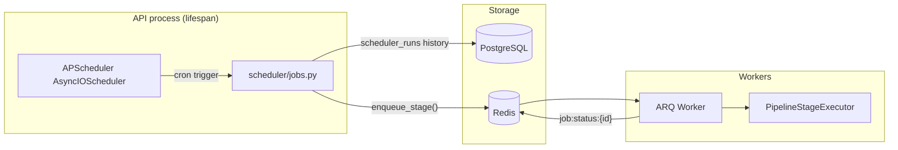
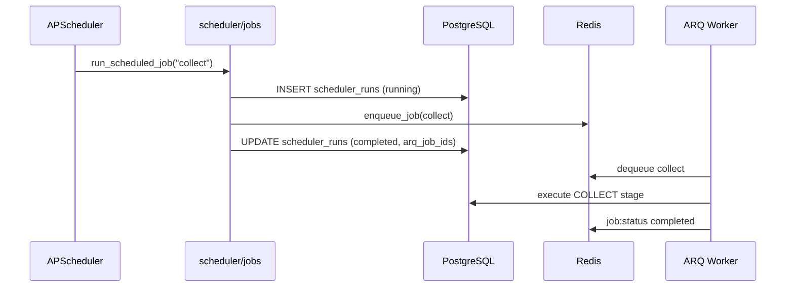

# Venture Studio Scheduler (APScheduler)

## Overview

The scheduler runs the Venture Studio pipeline automatically on a daily cron. It does **not** execute heavy work in-process — each scheduled slot **enqueues ARQ background jobs** that workers process asynchronously.

This keeps the API responsive, reuses existing worker retries/locks/monitoring, and separates *when* work starts from *how* it runs.

## Architecture

### Daily default schedule (UTC)

| Time | Scheduler job | ARQ jobs enqueued |
|------|---------------|------------------|
| 02:00 | `collect` | `collect` |
| 03:00 | `classify` | `classify` |
| 04:00 | `generate_opportunities` | `generate_opportunities` |
| — | *(not scheduled)* | `score` — run via full pipeline or `POST /api/v1/jobs/score` |
| 05:00 | `research_agents` | `market_research`, `competitor_analysis`, `customer_research`, `revenue_validation`, `product_strategy`, `go_to_market`, `growth_strategy`, `human_proxy` |
| 06:00 | `executive_ranking` | `executive_ranking` |
| 07:00 | `venture_report` | `venture_report` |

Schedules are stored in `scheduler_jobs` and registered with APScheduler on startup. Disabled jobs are omitted from the cron registry.

## Components

| Module | Role |
|--------|------|
| `app/scheduler/scheduler.py` | APScheduler lifecycle — start, shutdown, sync enable/disable |
| `app/scheduler/jobs.py` | Job definitions, seed defaults, enqueue + history recording |
| `app/services/scheduler.py` | API-facing scheduler service |
| `app/repositories/scheduler_job.py` | Job configuration persistence |
| `app/repositories/scheduler_run.py` | Run history and failure tracking |
| `app/api/v1/scheduler.py` | REST endpoints |

## Execution flow

### Manual trigger

`POST /api/v1/scheduler/run/{job_name}` follows the same path with `trigger=manual`. Returns `202` with the scheduler run id and enqueued ARQ job ids.

### Idempotency

Each daily enqueue uses idempotency keys like `scheduler:collect:2026-06-03:collect` so duplicate cron firings or overlapping runs skip re-enqueue when a lock is held.

## Features

### Enable / disable schedules

- `PATCH /api/v1/scheduler/jobs/{job_name}` with `{ "enabled": false }`
- Updates PostgreSQL and removes/pauses the APScheduler job
- Disabled jobs reject manual triggers with `422`
- Scheduled cron skips disabled jobs entirely

### Job history

Every scheduler invocation creates a row in `scheduler_runs`:

- `trigger` — `scheduled` or `manual`
- `status` — `pending`, `running`, `completed`, `failed`
- `arq_job_ids` — linked ARQ jobs for downstream monitoring via `GET /api/v1/jobs/{id}`
- `duration_ms`, `error`, `metadata`

`GET /api/v1/scheduler/jobs` includes `last_run` and `failure_count` per job.

### Failure tracking

Failures are recorded when:

- All ARQ enqueues fail → `status=failed`
- Some enqueues fail → `status=completed` with `error` describing partial failures
- Unexpected exceptions → `status=failed` with stack-derived message

ARQ execution failures are tracked separately in Redis (`JobMonitor`) and via domain tables (signals, opportunities, reports, etc.).

## Configuration

| Variable | Default | Description |
|----------|---------|-------------|
| `SCHEDULER_ENABLED` | `true` | Start APScheduler on API startup |
| `SCHEDULER_TIMEZONE` | `UTC` | Cron timezone (`ZoneInfo` name) |

Set `SCHEDULER_ENABLED=false` in tests or when running a scheduler-less API instance.

## API

| Method | Endpoint | Description |
|--------|----------|-------------|
| GET | `/api/v1/scheduler/jobs` | List jobs with schedule, enabled state, last run, failure count |
| PATCH | `/api/v1/scheduler/jobs/{job_name}` | Enable or disable a job |
| POST | `/api/v1/scheduler/run/{job_name}` | Manually trigger a job (202) |

All endpoints require `X-API-Key`.

## Database tables

### `scheduler_jobs`

Configured cron slots seeded on first access:

- `job_name`, `display_name`, `description`
- `schedule_hour`, `schedule_minute`
- `enabled`

### `scheduler_runs`

Execution audit trail linked by `job_name` FK.

Migration: `017_scheduler.py`

## Relationship to other systems

| System | Relationship |
|--------|--------------|
| **ARQ workers** | Scheduler enqueues; workers execute |
| **Pipeline orchestrator** | Independent — scheduler uses stage jobs, not `run_pipeline` |
| **Redis JobMonitor** | Tracks ARQ job lifecycle (7-day TTL) |
| **`pipeline_runs`** | Only populated by full orchestrator runs, not individual scheduled stages |

## Running locally

1. Start infrastructure: `docker compose up postgres redis worker`
2. Start API (scheduler starts automatically unless disabled)
3. List jobs: `curl -H "X-API-Key: $API_KEY" http://localhost:8000/api/v1/scheduler/jobs`
4. Manual run: `curl -X POST -H "X-API-Key: $API_KEY" http://localhost:8000/api/v1/scheduler/run/collect`

Ensure at least one ARQ worker is running to process enqueued jobs.
