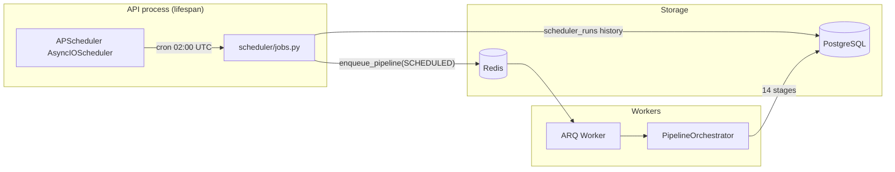
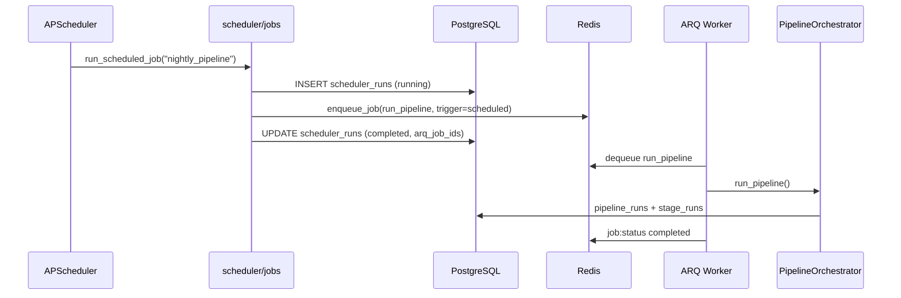

# Venture Studio Scheduler (APScheduler)

## Overview

The scheduler triggers **one orchestrated nightly pipeline run** via ARQ. It does not execute heavy work in-process — the cron slot enqueues a single `run_pipeline` job that the worker executes through `PipelineOrchestrator`.

This keeps the API responsive, produces one unified `pipeline_runs` record per night, and reuses orchestrator locking, retries, metrics, and tracing.

See [scheduler-orchestrator.md](./scheduler-orchestrator.md) for the remediation history (previously: fragmented per-stage cron jobs).

## Architecture

### Default schedule (UTC)

| Time | Scheduler job | ARQ job enqueued | Pipeline trigger |
|------|---------------|------------------|------------------|
| 02:00 | `nightly_pipeline` | `run_pipeline` | `PipelineTrigger.SCHEDULED` |

Legacy per-stage scheduler jobs (`collect`, `classify`, …) may remain in the database for history but are **disabled** on `ensure_defaults()`. They are not registered with APScheduler.

## Components

| Module | Role |
|--------|------|
| `app/scheduler/definitions.py` | `nightly_pipeline` job definition (`PIPELINE_ARQ_JOB = "run_pipeline"`) |
| `app/scheduler/jobs.py` | Enqueue orchestrator or (legacy) stage jobs; run history |
| `app/scheduler/scheduler.py` | APScheduler lifecycle — start, shutdown, sync enable/disable |
| `app/services/scheduler.py` | API-facing scheduler service |
| `app/repositories/scheduler_job.py` | Job configuration; disables legacy jobs |
| `app/repositories/scheduler_run.py` | Run history and failure tracking |
| `app/api/v1/scheduler.py` | REST endpoints |

## Execution flow

### Manual trigger

`POST /api/v1/scheduler/run/nightly_pipeline` follows the same enqueue path with `trigger=manual`. Returns `202` with the scheduler run id and ARQ job id.

Legacy job names (`collect`, `classify`, …) return **422** — they are no longer valid scheduler jobs.

### Idempotency

Scheduled runs set `idempotency_key=scheduler:nightly_pipeline:{YYYY-MM-DD}` on the `run_pipeline` ARQ job to avoid duplicate enqueues the same day.

## Features

### Enable / disable schedules

- `PATCH /api/v1/scheduler/jobs/{job_name}` with `{ "enabled": false }`
- Updates PostgreSQL and removes/pauses the APScheduler job
- Disabled jobs reject scheduled triggers; manual triggers still allowed unless disabled

### Job history

Every scheduler invocation creates a row in `scheduler_runs`:

- `trigger` — `scheduled` or `manual`
- `status` — `pending`, `running`, `completed`, `failed`
- `arq_job_ids` — linked ARQ jobs (one `run_pipeline` id for nightly)
- `metadata.execution_mode` — `"orchestrator"` for nightly runs
- `duration_ms`, `error`, `metadata`

## Configuration

| Variable | Default | Description |
|----------|---------|-------------|
| `SCHEDULER_ENABLED` | `true` | Start APScheduler on API startup |
| `SCHEDULER_TIMEZONE` | `UTC` | Cron timezone (`ZoneInfo` name) |

Set `SCHEDULER_ENABLED=false` in tests or when running a scheduler-less API instance.

## API

| Method | Endpoint | Description |
|--------|----------|-------------|
| GET | `/api/v1/scheduler/jobs` | List jobs (expect `nightly_pipeline`) |
| PATCH | `/api/v1/scheduler/jobs/{job_name}` | Enable or disable |
| POST | `/api/v1/scheduler/run/{job_name}` | Manually trigger (202) |

All endpoints require `X-API-Key`.

## Relationship to other systems

| System | Relationship |
|--------|--------------|
| **ARQ workers** | Scheduler enqueues `run_pipeline`; worker runs `PipelineOrchestrator` |
| **Pipeline orchestrator** | **Primary** scheduled path — one run, 14 stages, one `pipeline_runs` row |
| **Manual stage jobs** | `POST /api/v1/jobs/{stage}` still available; not used by cron |
| **Redis JobMonitor** | Tracks ARQ job lifecycle |
| **Alerting** | Pipeline failures and scheduler-offline alerts via `app/observability/alerting/` |

## Running locally

1. Start infrastructure: `docker compose up postgres redis worker`
2. Start API (scheduler starts automatically unless disabled)
3. List jobs: `curl -H "X-API-Key: $API_KEY" http://localhost:8000/api/v1/scheduler/jobs`
4. Manual run: `curl -X POST -H "X-API-Key: $API_KEY" http://localhost:8000/api/v1/scheduler/run/nightly_pipeline`

Ensure at least one ARQ worker is running. Full pipeline runs may exceed default `ARQ_JOB_TIMEOUT_SEC=600` — increase for production nightly runs.
