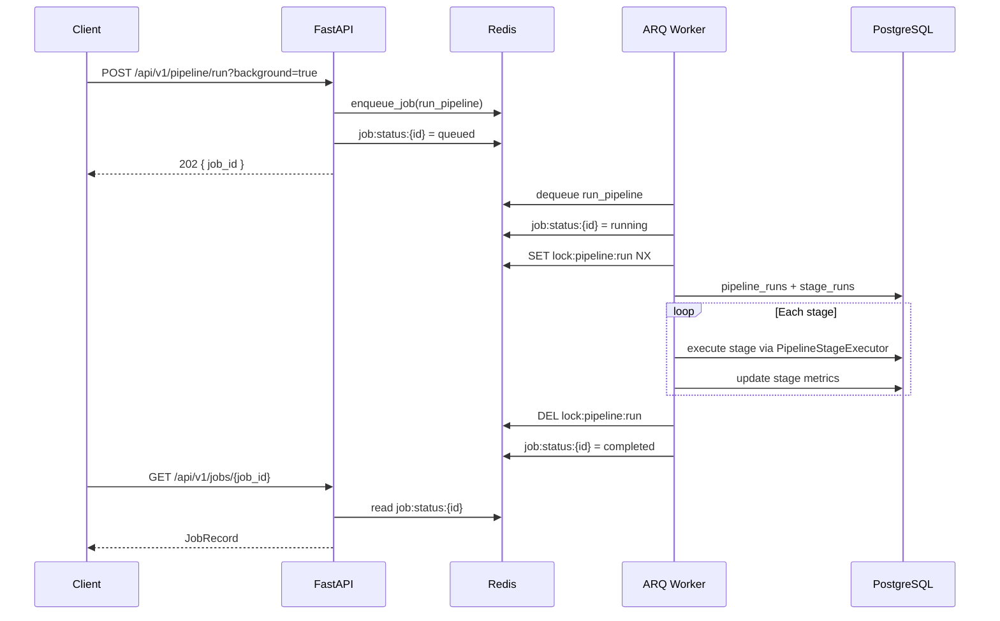

# Background Jobs (ARQ + Redis)

## Overview

Long-running Venture Studio work runs outside the FastAPI request cycle on **ARQ workers** backed by **Redis**. The API enqueues jobs; one or more worker processes execute them with retries, distributed locks, and Redis-backed monitoring.

## Components

| Module | Role |
|--------|------|
| `app/workers/worker.py` | ARQ `WorkerSettings` — worker entrypoint |
| `app/workers/jobs.py` | Job functions for each pipeline stage |
| `app/workers/enqueue.py` | API-side job publishing |
| `app/workers/monitoring.py` | Redis job status tracking |
| `app/workers/context.py` | Worker startup/shutdown and DB sessions |
| `app/pipeline/executor.py` | Shared stage logic (orchestrator + jobs) |

## Execution Flow



### Synchronous vs background

| Mode | Endpoint | Behavior |
|------|----------|----------|
| Sync | `POST /api/v1/pipeline/run` | Blocks until pipeline finishes (201) |
| Background | `POST /api/v1/pipeline/run?background=true` | Enqueues `run_pipeline` job (202) |
| Stage only | `POST /api/v1/jobs/{job_name}` | Enqueues one stage job (202) |
| Full pipeline | `POST /api/v1/jobs/run-pipeline` | Enqueues `run_pipeline` (202) |

## Registered Jobs

| Job name | Pipeline stage |
|----------|----------------|
| `collect` | COLLECT |
| `classify` | CLASSIFY |
| `generate_opportunities` | GENERATE_OPPORTUNITIES |
| `score` | SCORE_OPPORTUNITIES |
| `market_research` | MARKET_RESEARCH |
| `competitor_analysis` | COMPETITOR_ANALYSIS |
| `customer_research` | CUSTOMER_RESEARCH |
| `revenue_validation` | REVENUE_VALIDATION |
| `product_strategy` | PRODUCT_STRATEGY |
| `go_to_market` | GO_TO_MARKET |
| `growth_strategy` | GROWTH_STRATEGY |
| `human_proxy` | HUMAN_PROXY |
| `executive_ranking` | EXECUTIVE_RANKING |
| `venture_report` | VENTURE_REPORT |
| `run_pipeline` | All 14 stages via orchestrator |

## Reliability

### Retries

- ARQ `max_tries` (default 3) with worker-level re-queue
- Failed attempts logged to Redis (`status=deferred`) until final failure (`status=failed`)

### Distributed safety

- **Full pipeline:** `lock:pipeline:run` Redis lock + DB `running` check (orchestrator)
- **Stage jobs:** optional `idempotency_key` in job options → `lock:job:{name}:{key}` skip duplicates
- Workers are stateless; any worker can process any job

### Monitoring

Redis keys:

- `job:status:{job_id}` — JSON `JobRecord` (TTL 7 days)
- `jobs:recent` — sorted set of recent job IDs

Query via:

- `GET /api/v1/jobs/{job_id}`
- `GET /api/v1/jobs?limit=20`

### Failure logging

Structured logs on every job:

- `Job completed` — INFO with job_id, job_name, attempt
- `Job failed` — EXCEPTION with attempt / max_tries

## Running locally

```bash
# Infrastructure
docker compose up -d postgres redis

# API
cd api && uvicorn app.main:app --reload

# Worker (separate terminal)
cd api && arq app.workers.worker.WorkerSettings
```

Or with Docker Compose:

```bash
docker compose up -d postgres redis api worker
```

## Configuration

| Env var | Default | Description |
|---------|---------|-------------|
| `ARQ_MAX_JOBS` | 5 | Concurrent jobs per worker |
| `ARQ_JOB_TIMEOUT_SEC` | 600 | Per-job timeout |
| `ARQ_MAX_TRIES` | 3 | ARQ retry attempts |
| `ARQ_JOB_RESULT_TTL_SEC` | 604800 | ARQ result retention |
| `ARQ_JOB_STATUS_TTL_SEC` | 604800 | Monitoring key TTL |
| `ARQ_JOB_LOCK_TTL_SEC` | 3600 | Idempotency lock TTL |

## Example

```bash
# Enqueue classify job
curl -X POST http://localhost:8000/api/v1/jobs/classify \
  -H "X-API-Key: $API_KEY" \
  -H "Content-Type: application/json" \
  -d '{"options": {"classify_batch_size": 25}}'

# Poll status
curl http://localhost:8000/api/v1/jobs/{job_id} \
  -H "X-API-Key: $API_KEY"
```
